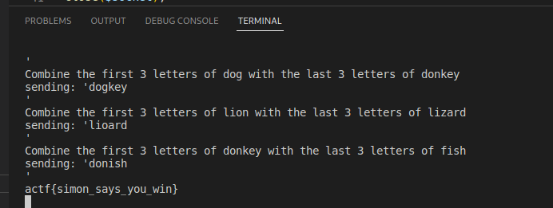

# Introduction

This (very late) writeup is for the [2023 ångstromCTF](https://2023.angstromctf.com/) "Simon Says" misc challenge. This challenge involved using netcat to answer three questions in a very short time frame. The three questions are very similar. It involved taking the first three letters of one word and concatenating them with the last three letters of a second word. I wrote a perl script to connect to the TCP connection, read the two words, concatenate a new word, and send it back, repeating until the flag is given.

# Perl Script
```perl
#!/usr/bin/perl

use strict;
use warnings;
use IO::Socket;

my $remote_host = "challs.actf.co";
my $remote_port = 31402;
my $buf = "";

# Example question:
# Combine the first 3 letters of vulture with the last 3 letters of dolphin

my $socket = IO::Socket->new(
    Domain   => IO::Socket::AF_INET,
    PeerAddr => $remote_host,
    PeerPort => $remote_port,
    Proto    => "tcp",
    Type     => IO::Socket::SOCK_STREAM)
or die "Couldn't connect to $remote_host:$remote_port : $@\n";

;
while (1) {
    $socket->recv($buf, 8192);
    print $buf;
    if ($buf =~ /actf.*/) {last;}
    my $data = $buf;
    if ($data =~ /Combine the first 3 letters of (\w+) with the last 3 letters of (\w+)/) {
        my $first = substr $1, 0, 3;
        my $last = substr $2, -3, 3;
        my $string = $first . $last . "\n";
        print("sending: $string");
        $socket->send($string)
        or die "Can't send: $!\n";
    }
}
close($socket);
```

# Result


The script quickly solved the server's three questions which rewarded us with the challenge's flag. It should also be noted that I adapted this script from my friend Reid's python script, which originally solved the challenge for our team. I wanted to challenge myself by solving the flag with a perl script.
