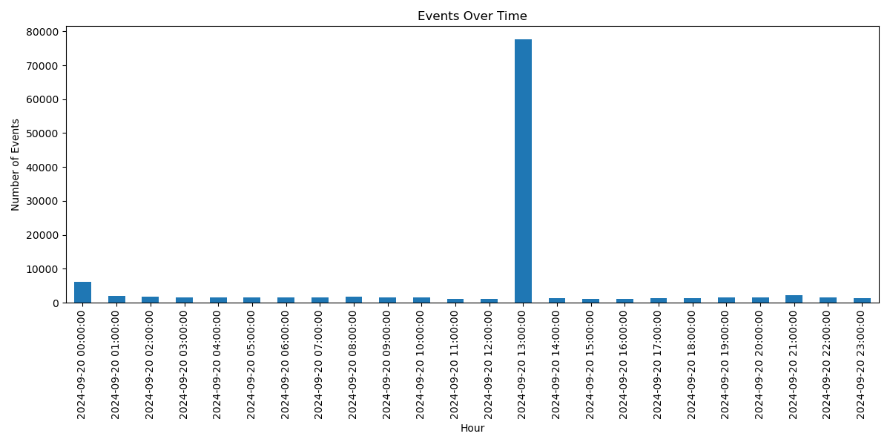
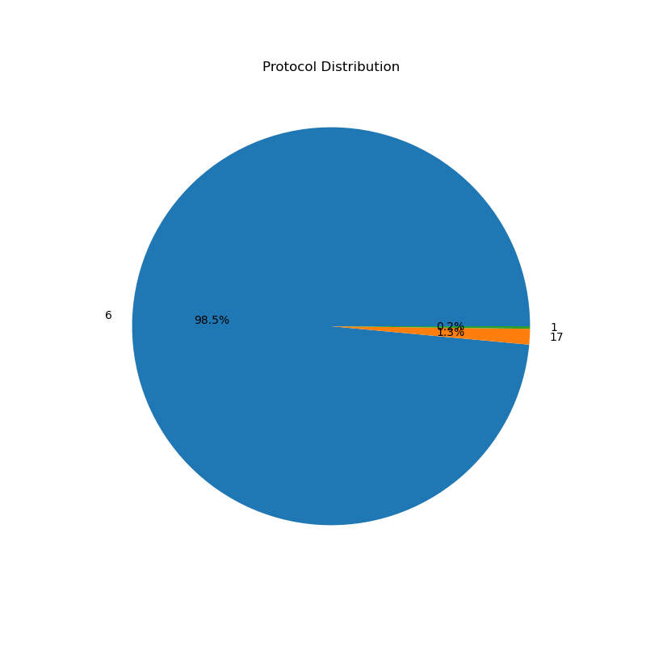

## Introduction

The SANS Technology Institute's Internet Storm Center offers a [honeypot service](https://isc.sans.edu/tools/honeypot/) that anyone can install on their local network to monitor cyber attacks. The honeypot, named DShield Honeypot, sends data from the honeypot to the ISC, and you can create an account to view your own logs and statistics. This past August I set up one of these honeypots on a free AWS instance to see what attacks my instance would get.

## Instance Info

I am running an [Amazon Web Server EC2](https://aws.amazon.com/ec2/) instance. The instance is located in Northern California, and it is running Ubuntu with the DShield Honeypot installed through [this tutorial](https://youtu.be/fMqhoNnyvmE).

## Generating Quick Stats with Claude and Pandas

Now I don't have much experience with data science, and I don't have time to learn it (because I'm writing this blog post the day before I post it), so this seems like a great excuse to use a large language model: [Claude](https://www.anthropic.com/claude).

I first give Claude my current scenario: I have some firewall logs that I can save in three formats (XML, JSON, TAB), and I need a tool that will give me some statistics on these logs. Claude offers me some tools, like XMLStarlet and awk, but also some professional software, like Splunk and ELK stack. I clarify with Claude that I am only doing this in my free time, and I need something that is free and easy to use. Claude recommends using Python with pandas. I don't have experience with pandas, but I do know Python so I go with that.

I give Claude two log entries from my honeypot's firewall and I ask it what statistics could I run on it. Claude gives me a Python script that uses pandas, and after some back and forth and some debugging and editing, I get this final script:

```python
import pandas as pd
import matplotlib.pyplot as plt
import json

# Load data from single-line JSON file
with open('firewall_logs.json', 'r') as file:
    data = json.load(file)

# Convert to DataFrame
df = pd.DataFrame(data)

# Combine date and time into a single datetime column
df['datetime'] = pd.to_datetime(df['date'] + ' ' + df['time'], format='%Y-%m-%d %H:%M:%S')

# 1. Count of events by source IP
source_counts = df['source'].value_counts()
print("1. Events by source IP:\n", source_counts.head())

# 2. Count of events by target port
target_port_counts = df['targetport'].value_counts()
print("\n2. Events by target port:\n", target_port_counts.head())

# 3. Events over time (hourly bins)
df['hour'] = df['datetime'].dt.floor('H')
hourly_counts = df['hour'].value_counts().sort_index()
print("\n3. Events per hour:\n", hourly_counts.head())

# 4. Protocol distribution
protocol_counts = df['protocol'].value_counts()
print("\n4. Protocol distribution:\n", protocol_counts)

# 5. Top 5 source ports
top_source_ports = df['sourceport'].value_counts().head()
print("\n5. Top 5 source ports:\n", top_source_ports)

# 6. Calculate time differences between events
df = df.sort_values('datetime')
df['time_diff'] = df['datetime'].diff().dt.total_seconds()
avg_time_between_events = df['time_diff'].mean()
print(f"\n6. Average time between events: {avg_time_between_events:.2f} seconds")

# Visualization: Events over time
plt.figure(figsize=(12, 6))
hourly_counts.plot(kind='bar')
plt.title('Events Over Time')
plt.xlabel('Hour')
plt.ylabel('Number of Events')
plt.tight_layout()
plt.show()

# Visualization: Protocol Distribution
plt.figure(figsize=(8, 8))
protocol_counts.plot(kind='pie', autopct='%1.1f%%')
plt.title('Protocol Distribution')
plt.ylabel('')
plt.show()
```

Examining my firewall log history on dshield.org, I see a huge report spike on September 20th, 2024. I download the reports for that day, and I plug it into the script.

Here is the output:

```console
$ python3 firewall-log-analyzer.py
1. Events by source IP:
 source
172.233.32.48      32612
172.233.56.83      18280
172.233.56.7       17024
172.235.166.121     6276
165.154.0.174       4304
Name: count, dtype: int64

2. Events by target port:
 targetport
23      77945
2222     1410
443       910
80        797
8728      552
Name: count, dtype: int64

3. Events per hour:
 hour
2024-09-20 00:00:00    6044
2024-09-20 01:00:00    1914
2024-09-20 02:00:00    1712
2024-09-20 03:00:00    1584
2024-09-20 04:00:00    1514
Name: count, dtype: int64

4. Protocol distribution:
 protocol
6     115140
17      1484
1        244
Name: count, dtype: int64

5. Top 5 source ports:
 sourceport
35218    3176
49198     744
43789     677
42932     397
57658     389
Name: count, dtype: int64

6. Average time between events: 0.74 seconds
```

And here are the two visualizations:




