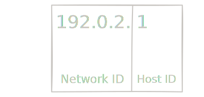

## Introduction

When learning about IP version 4, the concept of netmasks can be hard to grasp. This is especially so since, depending on your sources, there can be *two* definitions of a netmask: a network mask and a sub-network mask. Random people on the Internet (the best source of information, of course) claim that [the two are the same](https://superuser.com/questions/315352/what-is-the-difference-between-a-subnet-mask-and-a-netmask), but CompTIA seems to separate them when first learning about IP addresses. This lead to confusion on my part, so I will try to clear this up to the best of my ability and further explain the use of netmasks in this post.

### Disclaimer

If you find anything factually incorrect in this blog post, please get into contact with me [here](#contact), and I will correct the mistake as soon as possible.

## The Network Mask

An IP address holds two parts: a network ID and a host ID. The *network ID* comes first, and this number is shared between all hosts on the same network; If two IP addresses share the same network ID, then they are on the same network. The *host ID* identifies a host within a network.

In this example IP, the network ID is `192.0.2` and the host ID is `1`.
